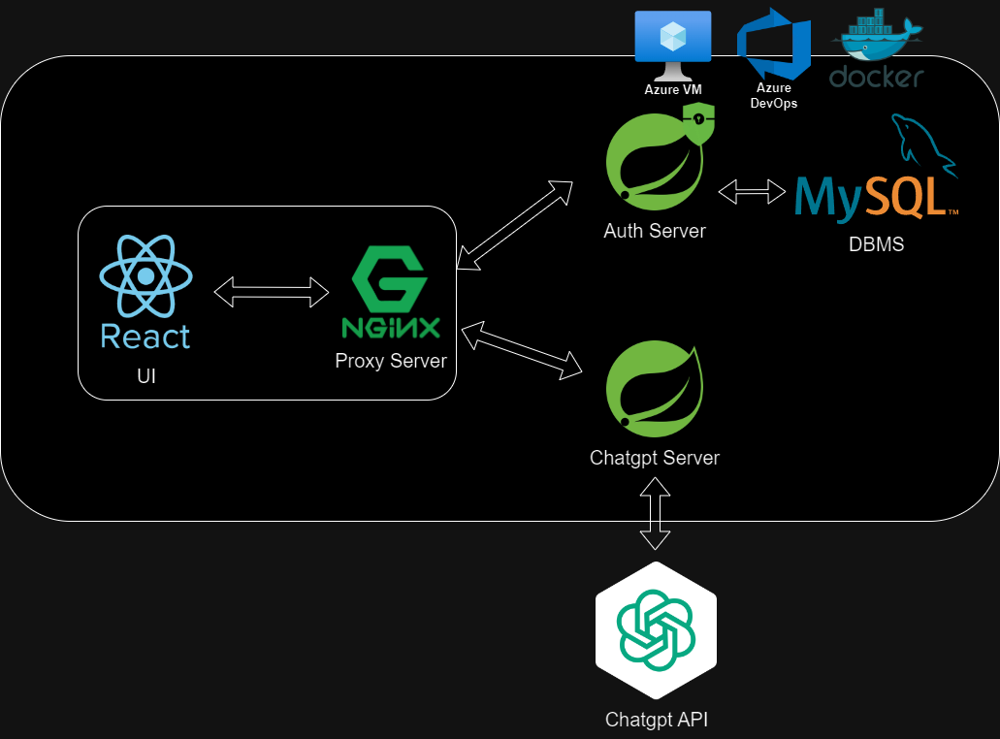

# Ai-Mail

## 🎞️Project Outline
> 학교생활, 사회생활등을 함에 있어 다양한 메일들을 작성해야 할 때, 맞춤법이나 높임말, 존칭과 같은 다양한 부분에서 신경을 쓰지 않을 수 없다. 특히 신입생과 같은 교수님 또는 윗어른과 소통을 많이 해보지 않은 사람들은 격식체를 사용하는 것에 생각보다 많은 어려움을 느낀다. 이러한 어려움을 도와줄 수 있는 툴이 있었으면 좋겠다고 생각하였고, 뿐만 아니라 결과를 저장하여 격식체를 학습할 수 있는 공간도 마련하여 자연스럽게 사용 할 수 있게 도와주면 좋겠다고 생각했다.

## 🗓️Project Period
> 2023년 8월 1일 ~ 2023년 8월 28일

## 📕Tech Stack & Tools
### FRONTEND
  

### BACKEND
#### - Auth Server
    

#### - Chatgpt Server
  

### DEVOPS
     

## ⚙️Architecture

## 🎉나의 주요기능 및 맡은 역할
### Auth Server
- 회원가입
    - 기본적인 정보를 입력하여 회원가입 지원
    - BCryptPasswordEncoder를 통한 비밀번호 암호화
- 로그인
    - Spring Security를 이용한 로그인 지원
    - JWT를 이용하여 로그인시 Access Token 과 Refresh 토큰을 발급
    - Spring Security의 필터를 custom하여 Front에서 오는 HTTP 요청의 헤더에 있는 토큰 검사
        - Access Token 유효시 유저 정보를 사용할 수 있는 권한 부여
        - Access Token 만료시 Refresh Token 검사
            - Refresh Token 유효시 Access Token을 새로 발급하여 사용자에게 전달후 권한 부여
            - Refresh Token 만료시 접근 거부 및 로그인 페이지 리다이렉트
    - CORS error 해결

## 😌느낀점

> Agile 방법론을 통한 프로젝트 관리를 통해 0부터 배포까지 진행한 프로젝트
> 
- Azure Devops를 통해 프로젝트 일정을 관리하며 왜 Agile 방법론이 필요한 지를 느낀 프로젝트
    - 팀원간의 진행상황을 공유하기 쉽고 그에 따른 일정 수립과 진행이 가능했었다.
    - 규칙적인 스프린트를 진행하지는 못했었던 것이 아쉽다.
- 처음으로 클라우드 서비스를 통한 배포까지 완료해본 프로젝트
    - 충북대학교 SW중심대학 사업단에서 진행한 몰입교육의 지원 덕분에 평소에는 엄두내지 못했던 클라우드 서비스를 통해 배포까지 성공했다.
    - 내 컴퓨터에서만 돌아가는 것 까지만 진행하다가 모든 사용자들이 접근 가능하게 서비스를 배포해보니 정말 뿌듯했다😄.
    - 마지막 배포 과정에서 생각보다 시간을 많이 쏟아 Github action과 Azure Devops를 통한 CI/CD를 진행하다가 프로젝트가 끝나버린게 너무 아쉬웠다.